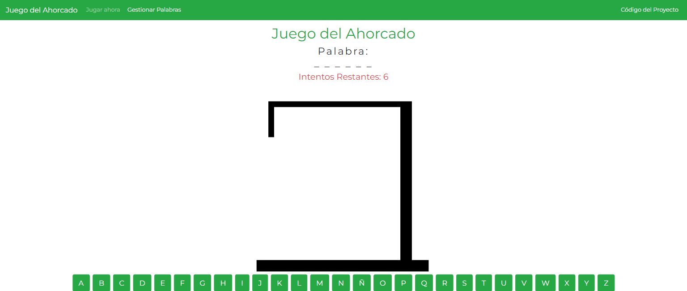

  
# Juego del Ahorcado

Este es un juego del ahorcado clásico implementado con HTML, CSS y JavaScript. El objetivo del juego es adivinar la palabra oculta antes de que se complete el dibujo del ahorcado.

## Características

- Interfaz de usuario interactiva y fácil de usar.
- Soporte para palabras aleatorias o palabras personalizadas.
- Dibujo progresivo del ahorcado a medida que se cometen errores.
- Control de puntuación para llevar un registro de los aciertos y fallos.

## Instalación y Uso

1. Clona o descarga el repositorio en tu máquina local.
2. Abre el archivo `index.html` en tu navegador web.
3. El juego del ahorcado se cargará y podrás comenzar a jugar.

## Personalización

Puedes personalizar el juego del ahorcado modificando el archivo `index.html` y el archivo `words.html`.
  
## Tecnologías utilizadas

Este conversor fue construido utilizando HTML, CSS y JavaScript.

## Demo del código

Puedes ver el resultado final del código aquí: https://demos-github-jl.000webhostapp.com/Juego_del_ahorcado_usando_js/index.html

## Licencia

Este proyecto está bajo la Licencia MIT. Consulte el archivo LICENSE para obtener más detalles.
  
## ¿Cómo contribuir?

¡Siéntete libre de contribuir a este repositorio agregando tus propios proyectos! Para hacerlo, sigue estos pasos:

1. Haz un fork de este repositorio.
2. Crea una nueva carpeta para tu proyecto dentro del repositorio.
3. Agrega los archivos necesarios para tu proyecto, junto con un archivo README que proporcione información sobre el proyecto y cómo ejecutarlo.
4. Envía una solicitud de extracción para que tu proyecto sea revisado y agregado al repositorio principal.

¡Gracias por contribuir! Juntos, podemos construir una comunidad activa y colaborativa de programación.   

## Captura del proyecto

  
  

